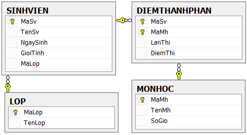

Cho một cơ sở dữ liệu được thiết kế như sau:

1. Khóa chính trong bảng dùng để làm và có những ràng buộc gì

2. Khóa ngoại là gì và có những ràng buộc gì

3. Có những loại join nào và cho biết sự khác nhau giữa chúng

Viết câu lệnh sql để:

4. Tạo các bảng và mối quan hệ giữa các bảng trên

5. Lấy danh sách sinh viên nam

6. Lấy danh sách sinh viên trên 18 tuổi

7. Lấy danh sách sinh viên lớp 12A

8. Lấy danh sách sinh viên của lớp 11A có điểm trung bình môn Hóa >= 8

9. Lấy danh sách sinh viên có điểm trung bình >=8 và giới hạn chỉ lấy tối đa 10 sinh viên và sắp xếp điểm giảm dần theo định dạng

|Họ tên| Lớp |  ĐTB |
|------|--------|------|
| Tuấn |12B|9.6 |
| Nam |11C|8.4 |
| Nguyên|12A|8.2|

10. Lấy danh sách sinh viên bị điểm kém theo môn (điểm TB < 3.5) và in ra bảng  và Sắp xếp theo lớp --> tên --> môn

Xem ví dụ:

|Lớp|Họ tên|Môn học|Điểm|
|--|--|--|--|
|10A|An|Toán|3|
|10B|Bình|Văn|2|
|10B|Tuấn|Sinh học|1|
|11A|Cường|Lịch sử|2|

